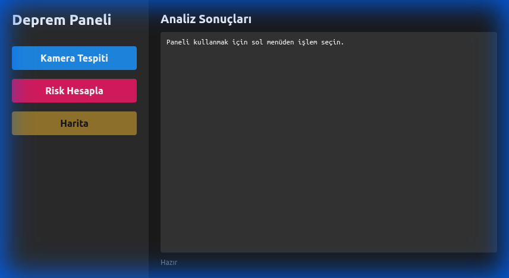
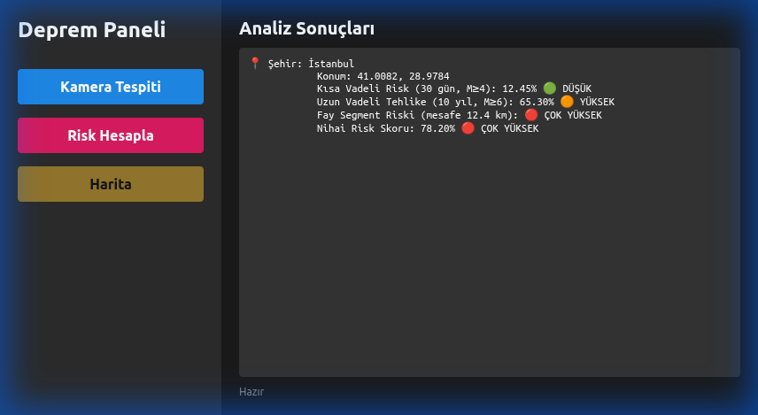
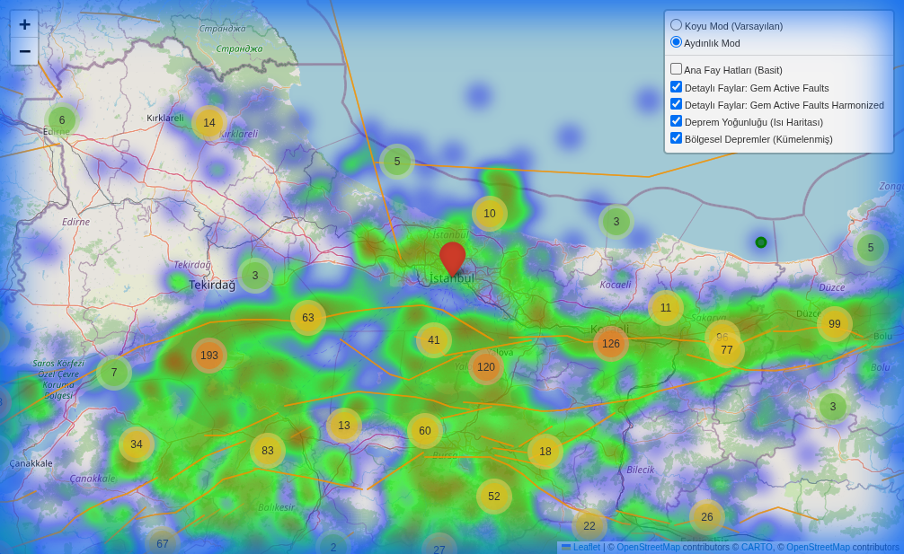
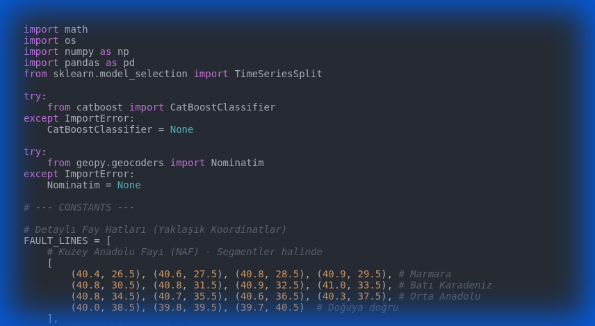

# 🌍 Deprem Risk ve Tespit Paneli


Türkiye genelindeki deprem riskini analiz etmek, aktif fay hatlarını görselleştirmek ve gerçek zamanlı veri akışı sağlamak amacıyla geliştirilmiş kapsamlı bir masaüstü uygulamasıdır.



## 🚀 Özellikler

*   **Şehir Bazlı Risk Analizi:** Seçilen şehir için kısa ve uzun vadeli deprem riskini hesaplar.
*   **İnteraktif Harita:** Aktif fay hatlarını ve deprem merkez üslerini detaylı harita üzerinde gösterir.
*   **Canlı Veri Akışı:** Kandilli Rasathanesi API'si üzerinden anlık deprem verilerini takip eder.
*   **Görüntü İşleme (Beta):** Kamera bağlantısı ile yapısal hasar tespiti için altyapı sunar.
*   **Modern Arayüz:** Kullanıcı dostu, karanlık mod destekli arayüz.

## 🛠️ Kurulum

Projeyi yerel makinenizde çalıştırmak için aşağıdaki adımları izleyin.

### Gereksinimler

*   Python 3.10 veya üzeri
*   `pip` paket yöneticisi

### Adımlar

1.  Projeyi klonlayın:
    ```bash
    git clone https://github.com/kullaniciadi/turkey-earthquake-project.git
    cd turkey-earthquake-project
    ```

2.  Gerekli kütüphaneleri yükleyin:
    ```bash
    pip install -r requirements.txt
    ```

3.  Uygulamayı başlatın:
    ```bash
    python gui_app.py
    ```

## 📊 Ekran Görüntüleri

### Risk Analizi
İstanbul için yapılan örnek bir risk analizi sonucu. Sistem, tarihsel verileri ve fay hattı mesafesini kullanarak bir risk skoru üretir.



### Harita Görünümü
Fay hatları, deprem yoğunluk haritası ve son depremlerin görselleştirilmesi.



## 🧩 Kod Yapısı

Proje modüler bir mimariye sahiptir:

*   `gui_app.py`: Ana kullanıcı arayüzü ve olay yönetimi.
*   `risk_engine.py`: Risk hesaplama algoritmaları ve makine öğrenmesi modelleri.
*   `map_visualizer.py`: Folium tabanlı harita üretim modülü.
*   `data_manager.py`: API veri çekme ve veritabanı yönetimi.
*   `camera_manager.py`: YOLO tabanlı görüntü işleme modülü.



## 🤝 Katkıda Bulunma

1.  Bu depoyu forklayın.
2.  Yeni bir özellik dalı oluşturun (`git checkout -b feature/yeni-ozellik`).
3.  Değişikliklerinizi commit yapın (`git commit -m 'Yeni özellik eklendi'`).
4.  Dalınızı pushlayın (`git push origin feature/yeni-ozellik`).
5.  Bir Pull Request oluşturun.

## 📄 Lisans

Bu proje MIT Lisansı ile lisanslanmıştır. Detaylar için `LICENSE` dosyasına bakınız.
